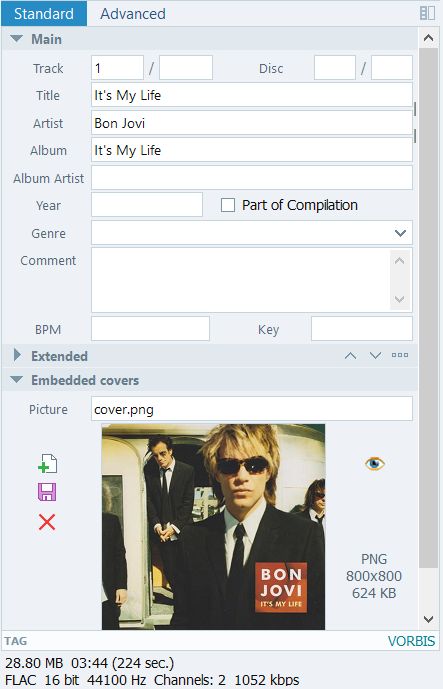

# NCMDump.NET

Decipher .ncm file to mp3 || flac

## Feature

Highly Optimized Corelib.

Keep ID3 tags and cover image.



### [Change Log](./ChangeLog.md)

## System Requirement

```Windows 11 10.0.22000.0``` & ```.NET 10 Desktop Runtime``` (Minimum)

Linux with .NET 10 runtime

## Usage

### CLI

```bash
ncmdump <file_or_directory> [file_or_directory]... [-o <output_dir>] [-d <depth>]
```

Drag .ncm file or directory on exe

### GUI

Don't ask, Just use.

## API

### ConvertAsync

```csharp
Task<bool> ConvertAsync(string path, string? outputDir = null, CancellationToken cancellationToken = default)
```

Convert NCM file into MP3/FLAC format asynchronously.

#### Parameters

- `path` - File path to a .ncm file.
- `outputDir` - Optional output directory. When null, output is placed next to the source file. (since v2.7.0)
- `cancellationToken` - Cancellation token.

#### Return

`true` if conversion succeeded.

## Reference
<https://github.com/mono/taglib-sharp>

<https://github.com/lepoco/wpfui>

<https://github.com/anonymous5l/ncmdump>

## Stargazers over time

[](https://starchart.cc/kingsznhone/NCMDump.NET)
